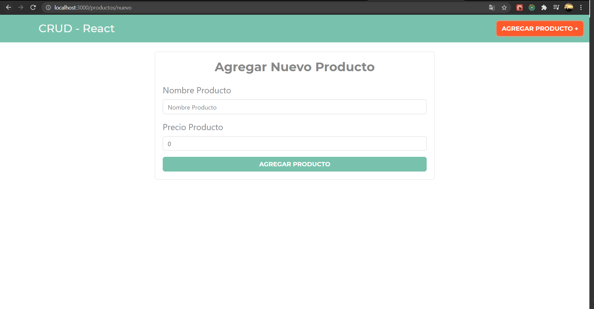
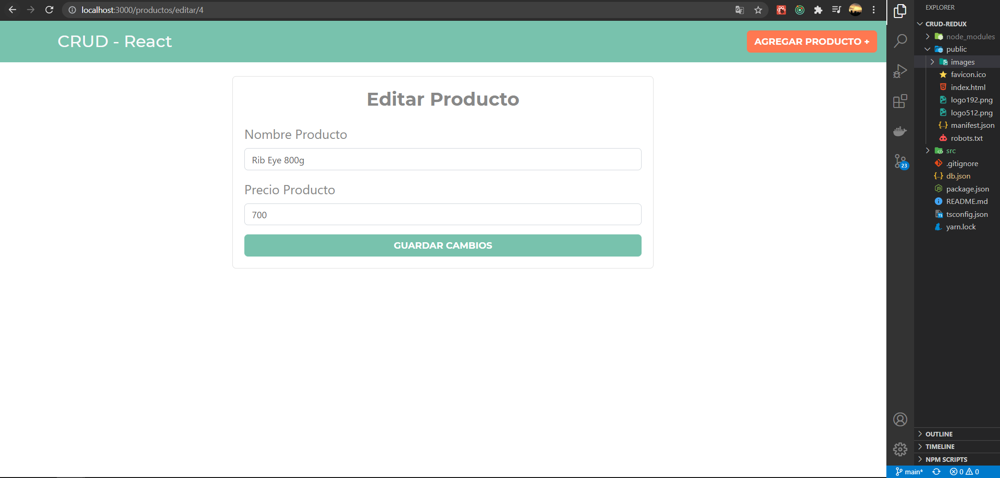

#CRUD REACT- REDUX - TYPESCRIPT - JSON-SERVER

####Comandos para arrancar el proyecto

**yarn  start:** inicia la aplicacion en modo desarrollo.
**yarn build: ** para generar el compilado.
**yarn json-server:** para levantar la api para el CRUD.

# Descripcion
- para la interfaz se uso bootstrap par el maquetado
- Es un CRUD para registrar productos

# Imagenes

)
